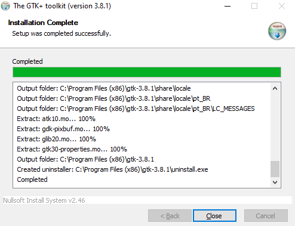

# Markdown Forge

A professional Markdown to PDF/DOCX converter with a live preview interface built with Streamlit.

## Features

✨ **Multiple Output Formats**
- PDF generation with WeasyPrint
- DOCX (Microsoft Word) export
- Configurable styling and layout

🎨 **Rich Markdown Support**
- Standard CommonMark syntax
- Tables with auto-sizing
- Code blocks with syntax highlighting
- Task lists
- Footnotes
- Front matter support
- Page breaks (`\newpage`, `\pagebreak`)

🖼️ **Image Management**
- Easy image upload via Streamlit interface
- Automatic image organization
- Insert at specific line or append to document
- Preview images before insertion

📝 **Live Preview**
- Split-screen editor with PDF preview
- Real-time rendering
- Interactive editing

⚙️ **Customizable**
- YAML-based configuration
- Configurable fonts, colors, margins
- Heading styles
- Page layout options

## Screenshots

### Streamlit Interface


## Installation

### Prerequisites

#### 1. Python Requirements
```bash
pip install -r requirements.txt
```

#### 2. GTK3 Runtime (Windows) - **REQUIRED for PDF Generation**

WeasyPrint requires GTK3 for rendering PDFs on Windows.

**Download and Install GTK3:**

1. **Download GTK3 Runtime for Windows (64-bit)**:
   - Visit: [https://github.com/tschoonj/GTK-for-Windows-Runtime-Environment-Installer/releases](https://github.com/tschoonj/GTK-for-Windows-Runtime-Environment-Installer/releases)
   - Download the latest `gtk3-runtime-x.x.x-x-x-x-ts-win64.exe`

2. **Run the Installer**:
   - Install to default location: `C:\Program Files\GTK3-Runtime Win64\bin`
   - The application will automatically detect this path

3. **Verify Installation**:
   - Ensure `C:\Program Files\GTK3-Runtime Win64\bin` exists
   - The bin folder should contain `libcairo-2.dll` and other GTK libraries

**Alternative Installation Paths** (automatically detected):
- `C:\Program Files\GTK3-Runtime\bin`
- `C:\Program Files (x86)\gtk-3.8.1\bin`

> **Note**: If you install to a custom location, you may need to add it to your system PATH.

---

### Linux/Mac

GTK3 is typically available through system package managers:

**Ubuntu/Debian**:
```bash
sudo apt-get install libgtk-3-0 libpango-1.0-0 libpangocairo-1.0-0
```

**macOS** (with Homebrew):
```bash
brew install cairo pango gdk-pixbuf libffi
```

---

## Quick Start

### 1. Clone the Repository
```bash
git clone https://github.com/yourusername/markdown-forge.git
cd markdown-forge
```

### 2. Install Dependencies
```bash
pip install -r requirements.txt
```

### 3. Install GTK3 (Windows)
Follow the [GTK3 installation instructions](#2-gtk3-runtime-windows---required-for-pdf-generation) above.

### 4. Run the Streamlit App
```bash
streamlit run app.py
```

The app will open in your browser at `http://localhost:8501`

### 5. Command Line Usage
```bash
# Convert to PDF
python main.py sample.md -f pdf -o output.pdf

# Convert to DOCX
python main.py sample.md -f docx -o output.docx

# With custom config
python main.py sample.md -f pdf -c config/custom_config.yaml
```

---

## Usage

### Streamlit Interface

1. **Select a markdown file** from the dropdown
2. **Edit** in the left panel
3. **Preview** PDF in the right panel
4. **Upload images** using the sidebar
5. **Insert images** at specific lines or append
6. **Save changes** with the 💾 button
7. **Convert** to PDF or DOCX

### Markdown Features

The app uses the standard html features for markdown

#### Page Breaks
```markdown
Content on page 1

\newpage

Content on page 2

\pagebreak

Content on page 3
```

#### Images
```markdown

```

Or upload via the Streamlit interface!

#### Tables
```markdown
| Column 1 | Column 2 | Column 3 |
|----------|----------|----------|
| Data     | More     | Info     |
```

Tables automatically resize to fit the page width.

#### Links
```markdown
[Visit Google](https://www.google.com)
[Email Us](mailto:email@example.com)
```

Links are clickable in PDF output.

#### Line Breaks
```markdown
Line 1<br>
Line 2
```

---

## Configuration

Edit `config/default_config.yaml` to customize:

```yaml
document:
  page_size: A4
  margins:
    top: 2cm
    bottom: 2cm
    left: 2cm
    right: 2cm

fonts:
  body: Roboto
  heading: Roboto Slab
  code: Fira Code
  base_size: 11pt
  line_height: 1.5

styles:
  h1:
    size: 24pt
    weight: bold
    color: "#2c3e50"
  # ... more heading styles
```

---

## Project Structure

```
markdown-forge/
├── app.py                  # Streamlit interface
├── main.py                 # CLI interface
├── requirements.txt        # Python dependencies
├── config/
│   ├── default_config.yaml # Default styling config
│   └── schema.py          # Configuration schema
├── core/
│   ├── parser.py          # Markdown parser with plugins
│   └── utils.py           # Utility functions
├── renderers/
│   ├── pdf_renderer.py    # PDF generation
│   └── docx_renderer.py   # DOCX generation
├── templates/
│   └── base.html          # HTML template for PDF
├── tests/                 # Test files and examples
└── images/                # Uploaded images storage
```

---

## Dependencies

### Python Packages
- **markdown-it-py[plugins]** - Markdown parser with plugin support
- **weasyprint** - PDF generation
- **python-docx** - DOCX generation
- **jinja2** - HTML templating
- **pyyaml** - YAML configuration parsing
- **pydantic** - Configuration validation
- **typer** - CLI interface
- **streamlit** - Web interface

### System Dependencies
- **GTK3 Runtime** (Windows) - Required for PDF generation
- **Cairo, Pango** (Linux/Mac) - PDF rendering libraries

---

## Troubleshooting

### PDF Generation Fails

**Error**: `"WeasyPrint dependencies not found"`

**Solution**: Install GTK3 Runtime (see [Installation](#2-gtk3-runtime-windows---required-for-pdf-generation))

---

### Images Not Showing in PDF

**Check**:
1. Images are in the `images/` folder
2. Markdown uses relative paths: ``
3. Image files exist and aren't corrupted

---

### Links Not Clickable in PDF

**Note**: Link functionality depends on your PDF viewer:
- ✅ Adobe Acrobat Reader - Full support
- ✅ Microsoft Edge - Full support
- ✅ Google Chrome - Full support

Try opening the PDF in Adobe Reader if links don't work.

---

## Development

### Running Tests
```bash
# Test page breaks
python tests/test_page_break.py

# Generate test PDFs
python main.py tests/test_pagebreak.md -f pdf
python main.py tests/test_tabellen.md -f pdf
python main.py tests/test_links.md -f pdf
```

### Adding Custom Markdown Plugins

Edit `core/parser.py`:
```python
from my_plugin import my_custom_plugin

class MarkdownParser:
    def __init__(self):
        self.md = (
            MarkdownIt("commonmark", {"breaks": True, "html": True})
            .use(my_custom_plugin)
            # ... other plugins
        )
```

---

## Contributing

Contributions are welcome! Please feel free to submit a Pull Request.

---

## License

MIT License - feel free to use this project for any purpose.

---

## Acknowledgments

- **markdown-it-py** - Excellent Markdown parser
- **WeasyPrint** - High-quality PDF generation
- **Streamlit** - Beautiful web interfaces in Python

---

## Support

If you encounter any issues, please:
1. Check the [Troubleshooting](#troubleshooting) section
2. Ensure GTK3 is properly installed (for PDF generation)
3. Verify all Python dependencies are installed
4. Open an issue on GitHub with details

---

**Made with AI and ❤️ using Python and Streamlit**
